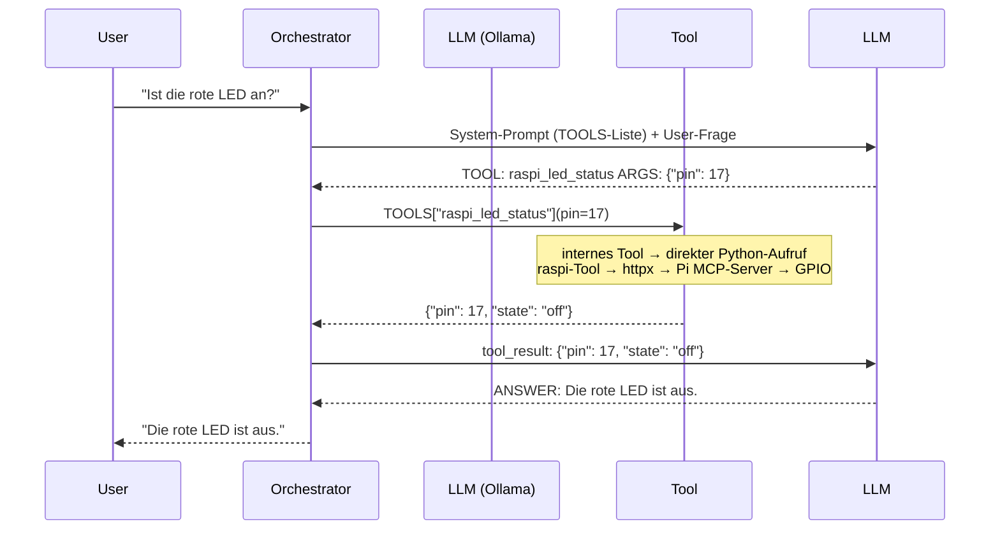

# Tool-Anbindung im Agenten

## Grundprinzip

Der Orchestrator hält ein Python-Dict `TOOLS` vor, das Tool-Namen auf Python-Funktionen
abbildet. Das LLM kennt nur die Namen und Docstrings dieser Tools (aus dem System-Prompt)
— es ruft **niemals selbst etwas auf**. Es gibt lediglich Text aus, z. B.:

```
TOOL: raspi_led_status ARGS: {"pin": 17}
```

Der Orchestrator parst diesen Text, schlägt den Funktionszeiger in `TOOLS` nach und
führt den tatsächlichen Aufruf durch.

## Ablauf



## Arten von Tools

Der Unterschied zwischen internen Tools und externen (raspi-) Tools ist rein
implementierungsseitig. Aus Sicht des Orchestrators und des LLM sind alle Tools gleich:
einfache Python-Funktionen mit Docstring.

| Tool | Aufruf durch Orchestrator | Transport |
|---|---|---|
| `search_documents` | `search_tools.search_documents(...)` | direkt Python → Django ORM → PostgreSQL |
| `raspi_led_status` | `raspi_tools.raspi_led_status(...)` | Python → httpx → HTTP → Pi → GPIO |

## Relevante Dateien

| Datei | Zweck |
|---|---|
| `agents/orchestrator.py` | `TOOLS`-Dict, Parsing-Loop, LLM-Aufruf |
| `agents/tools/search.py` | Interne Retrieval-Tools (Vektor-, Hybrid-, Metadatensuche) |
| `agents/tools/documents.py` | Interne Dokument-Tools (laden, verknüpfen, zusammenfassen) |
| `agents/tools/raspi.py` | Externer MCP-Client (httpx, Session-Management, 6 Hardware-Tools) |

## MCP-Anbindung (raspi-mcp)

`agents/tools/raspi.py` implementiert einen schlanken HTTP-Client für das
[raspi-mcp](http://pi1:8080/mcp) MCP-Servers auf dem Raspberry Pi:

1. Beim ersten Tool-Aufruf wird eine MCP-Session per `initialize`-Handshake eröffnet
   (Session-ID kommt im Response-Header `Mcp-Session-Id`).
2. Die Session-ID wird prozessweit gecacht und für alle Folge-Requests mitgesendet.
3. Antwortet der Server mit `400 Bad Request` (Session abgelaufen), wird einmalig neu
   initialisiert.
4. Ist der Pi nicht erreichbar, wirft die Funktion eine `RuntimeError`, die der
   Orchestrator als Tool-Fehlermeldung ans LLM weitergibt.

Das LLM entscheidet also nicht, *wie* ein Tool implementiert ist — es formuliert nur
die Anforderung. Die Anwendung übernimmt die Übersetzung in den passenden Aufruf.

## Statisches vs. dynamisches Tool-Register

Die Tool-Anbindung ist bewusst **statisch** gehalten. Jede neue Funktion (intern oder
per MCP) erfordert drei manuelle Schritte:

1. Tool implementieren (lokal in `agents/tools/` oder auf dem MCP-Server)
2. Wrapper-Funktion in `agents/tools/raspi.py` schreiben (nur bei MCP-Tools)
3. Eintrag in `TOOLS` im Orchestrator ergänzen

Eine dynamische Alternative (beim Start `tools/list` gegen den MCP-Server abfragen und
Tools automatisch registrieren) wurde bewusst **nicht** umgesetzt:

| | Statisch (gewählt) | Dynamisch |
|---|---|---|
| Kontrolle | Explizit, nachvollziehbar | Automatisch aus `tools/list` |
| Docstrings/Typen | In Python gepflegt | Aus MCP-Schema übernommen |
| Fehler | Auffällig beim Code-Review | Erst zur Laufzeit sichtbar |
| Aufwand bei Änderung | 3 Dateien anfassen | Nur MCP-Server ändern |

**Entscheidung**: Statischer Ansatz bleibt bestehen.
